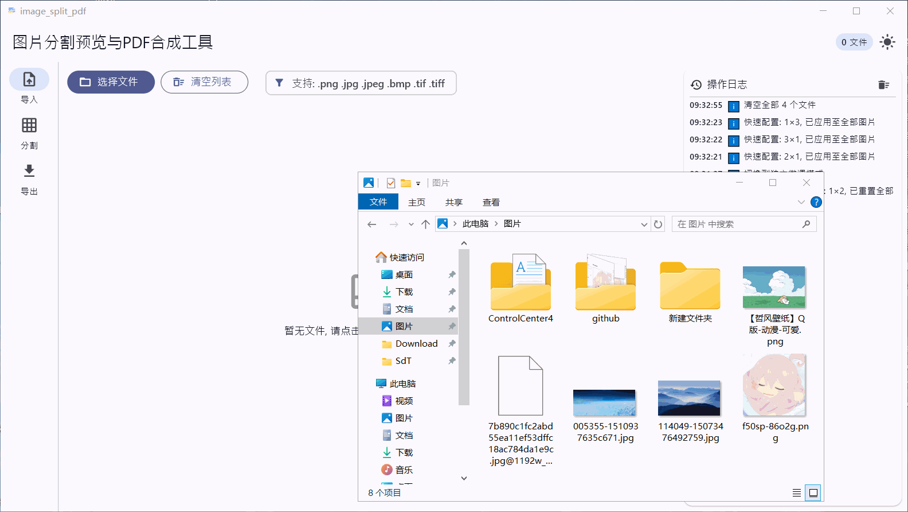
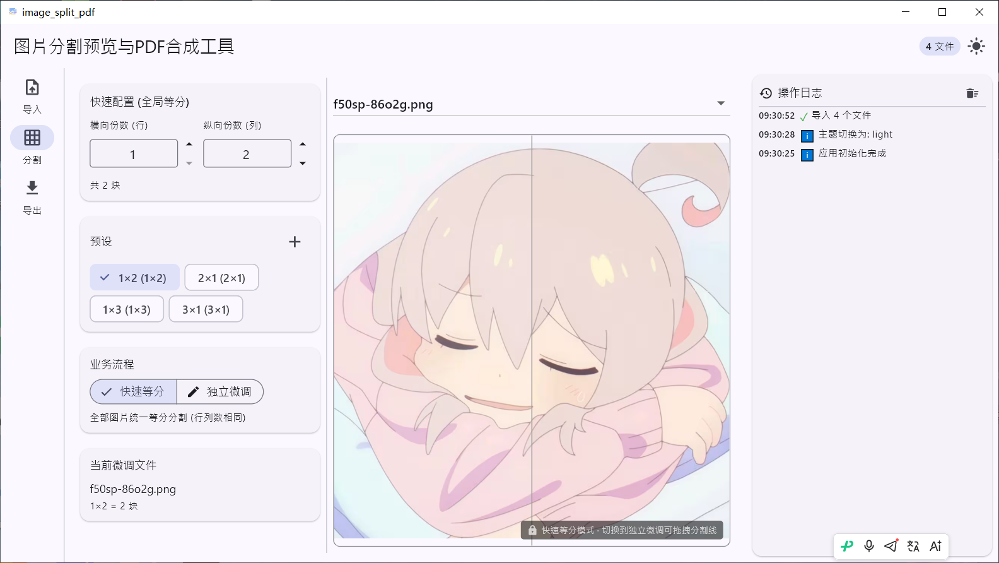
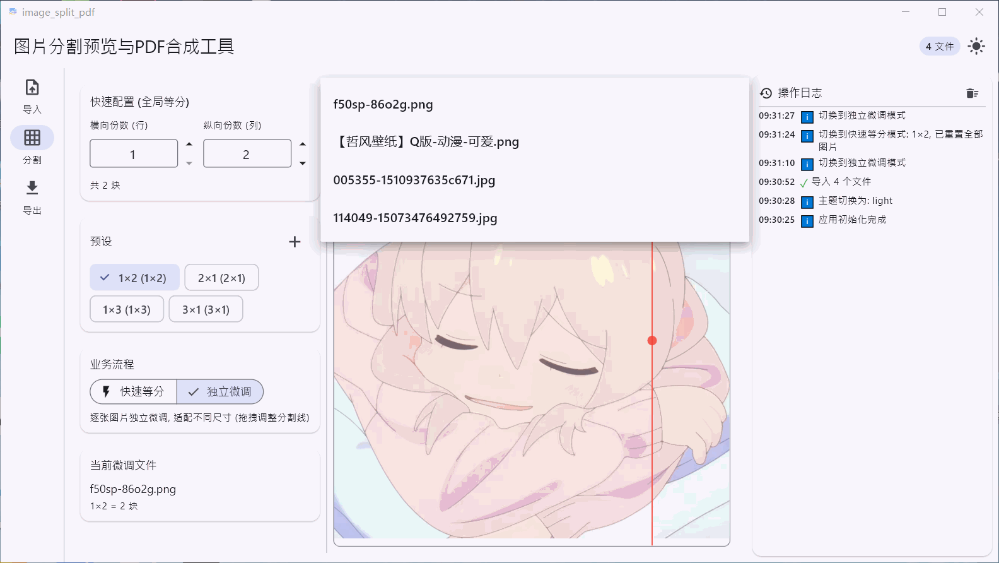
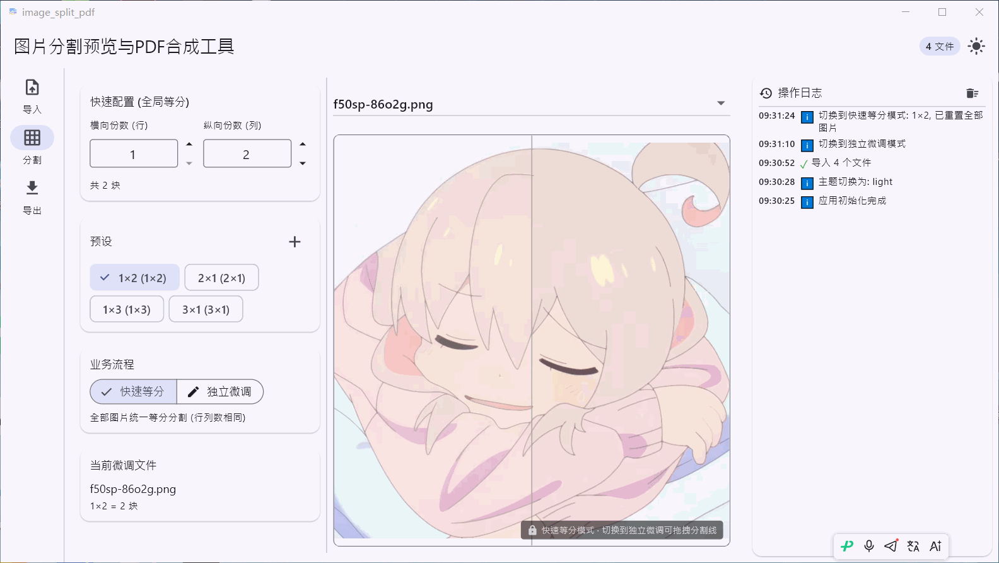
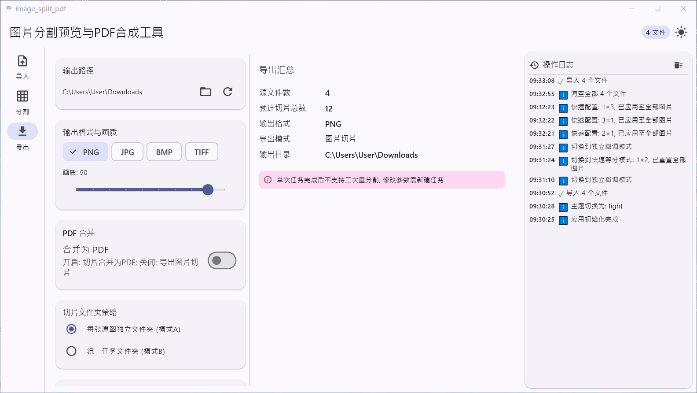

# 图片分割预览与PDF合成工具

基于 Flutter 的 Windows 桌面端图片分割与 PDF 合成工具。


> 1. 拖拽上传图片，支持批量导入


> 2. 选择分割预设，快速完成页面分割


> 3. 在列表切换多张图片，独立保存每张分割参数


> 4. 拖拽分割线，精细微调切片边界


> 5. 导出切片图片，或合并输出PDF文件

## ✨ 功能

- **图片导入**：支持 PNG / JPG / JPEG / BMP / TIFF，拖拽或文件选择导入，支持多文件有序列表
- **PDF转换**：支持将PDF转换为图片，可指定页码范围，自动添加到文件列表（详细使用说明见下文）
- **图片分割**：快速等分切割 + 独立微调拖拽分割线，实时预览分割效果
- **切片导出**：导出为 PNG / JPG / BMP / TIFF，自定义输出目录与文件命名规则
- **PDF 合并**：多文件切片按顺序合并为单个 PDF，每页保留原图尺寸
- **预设管理**：内置 `1×2`、`2×1`、`1×3`、`3×1` 分割预设，支持保存自定义分割方案
- **主题切换**：Material 3 设计，浅色 / 深色主题一键切换
- **配置持久化**：主题偏好、输出路径、自定义分割预设自动本地保存

### 🔍 PDF转换功能详细说明

**功能特点**：
- 支持 PDF 转 PNG 格式图片
- 可自由选择转换页码（支持单页、区间、混合格式）
- 自动将转换后的图片添加到文件列表，可直接进行分割操作
- 转换过程中显示进度提示

**使用方法**：
1. 点击主界面的 "PDF" 按钮（位于"选择文件"按钮旁边）
2. 选择要转换的 PDF 文件
3. 查看并确认 PDF 总页数
4. 输入页码表达式：
   - 单页：`5`
   - 区间：`1-3`
   - 混合格式：`1-3,5,10,12-15`
5. 确认转换，等待转换完成
6. 转换后的图片将自动添加到文件列表

**注意**：
- 转换后的图片会保存到自选文件夹

## 📥 直接下载（普通用户）
无需编译，前往 GitHub Releases 下载 Windows 已打包版本：
> https://github.com/amiena1011/ImageSplit/releases

下载对应文件，直接运行安装程序.

## 🖥️ 开发构建环境要求（开发者）

- Windows 10 / 11（64 位）
- Flutter 3.x（stable 或 master channel）
- JDK 17
- Visual Studio 2022（需要安装 **C++ 桌面开发**工作负载）

## 🚀 快速开始（开发者）

```powershell
# 拉取项目依赖
flutter pub get

# Debug模式运行程序
flutter run -d windows

# 编译 Release 正式版本
flutter build windows --release